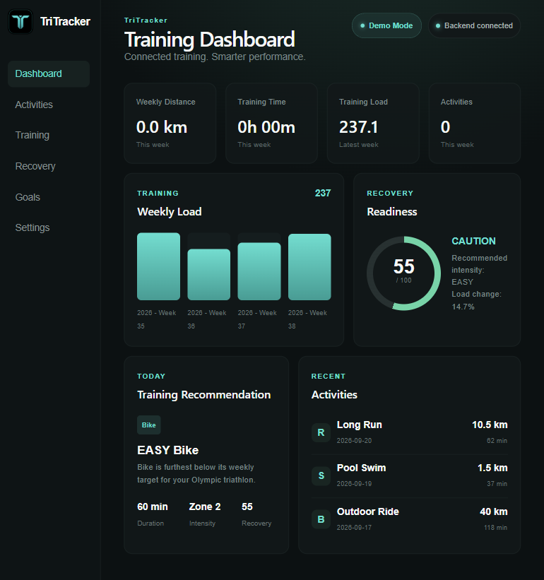
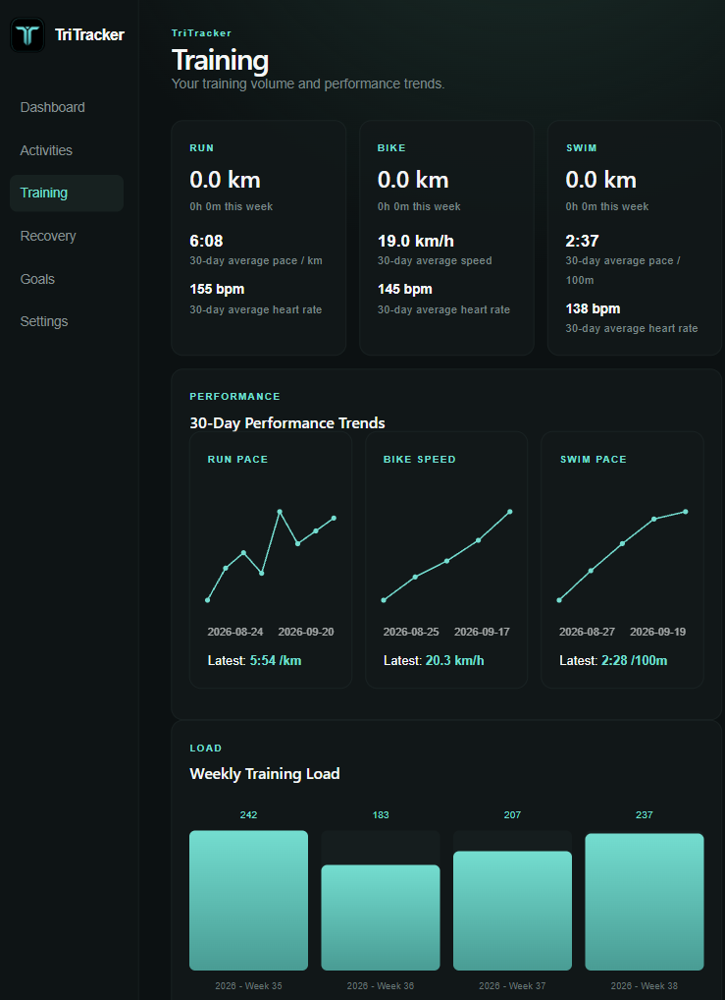
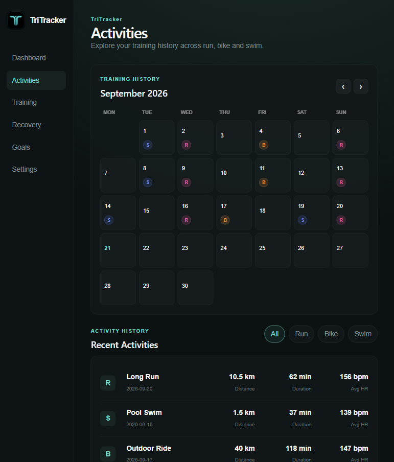

# TriTracker

A full-stack triathlon training dashboard that brings activity data, performance analytics, recovery insights and race goals into one application.


TriTracker was built as a personal sports-tech project to explore how software can turn raw endurance training data into useful insights for athletes.

## Features

### Training Dashboard

- Weekly training distance and duration
- Training load tracking
- Recent activity overview
- Recovery score
- Training recommendations
- Upcoming race countdown
- Swim, bike and run target comparison

### Activity Tracking

TriTracker supports:

- Running
- Cycling
- Pool swimming
- Open-water swimming
- Indoor and virtual activities

Activities imported from Strava are stored locally in SQLite and can be viewed through the activity history and training calendar.

### Strava Integration

The local version integrates with the Strava API to import activity data.

The synchronisation system:

- Authenticates using OAuth
- Refreshes expired access tokens
- Imports activities using paginated API requests
- Updates existing activities
- Adds new activities
- Reconciles deleted activities
- Maps Strava activity types into TriTracker sports

A 30-day reconciliation window keeps the local database consistent with recent Strava activity history.

### Performance Analytics

TriTracker calculates sport-specific performance metrics including:

- Running pace
- Cycling speed
- Swimming pace
- Average heart rate
- 30-day performance trends
- Weekly training load

### Recovery

Training history is analysed to produce a recovery score using recent training load and intensity.

The dashboard uses this information when generating the next training recommendation.

### Training Recommendations

TriTracker combines:

- Recent training volume
- Training balance across swim, bike and run
- Recovery
- Weekly training target
- Race goals

to suggest an appropriate next training session.

### Race Goals

Users can configure:

- Race name
- Race date
- Swim distance and target time
- Bike distance and target time
- Run distance and target time
- Weekly training target

TriTracker calculates discipline target pace/speed and overall target finishing time.

### Heart Rate Zones

Users can configure maximum and resting heart rate.

TriTracker calculates personalised training zones using heart-rate reserve.

### Training Calendar

Activities are displayed in a monthly calendar with separate colours for:

- Run
- Swim
- Bike

Individual activities can be opened to view their training details.

## Demo Mode

The deployed version runs in **Demo Mode** and uses sample training data so the application can be explored without access to a personal Strava account.

Personal Strava credentials, OAuth tokens and activity databases are not included in the repository or deployed application.

The local version can connect to Strava and synchronise real activity data.

## Tech Stack

### Backend

- Python
- FastAPI
- SQLite
- Pydantic
- Requests
- Pytest

### Frontend

- React
- TypeScript
- Vite
- CSS

### APIs and Services

- Strava API
- Render

## Architecture

```text
                    Local version
                         |
                    Strava API
                         |
                         v
              Authentication + Sync
                         |
                         v
                   SQLite Database
                         |
                         v
                   FastAPI Backend
                         |
                         v
                  REST API Endpoints
                         |
                         v
              React + TypeScript UI


                    Deployed demo
                         |
                  Sample Activity Data
                         |
                         v
                   SQLite Database
                         |
                         v
                   FastAPI Backend
                         |
                         v
              React + TypeScript UI
```

This separation means the frontend does not communicate directly with Strava. Activity synchronisation and analytics are handled by the backend.

## API

The FastAPI backend exposes endpoints including:

```text
GET  /health
GET  /activities
GET  /summary
GET  /performance
GET  /performance/trends
GET  /training-load
GET  /recovery
GET  /recommendation
GET  /calendar
GET  /goals
PUT  /goals
GET  /race-progress
GET  /hr-profile
PUT  /hr-profile
POST /strava/sync
```

## Testing

The backend includes automated tests covering the API, analytics, database operations, goals, recommendations, Strava synchronisation and activity reconciliation.

Run the test suite with:

```bash
pytest
```

## Running Locally

### 1. Clone the repository

```bash
git clone https://github.com/gabriellamcdade/TriTracker.git
cd TriTracker
```

### 2. Create a Python virtual environment

On Windows:

```powershell
python -m venv .venv
.venv\Scripts\Activate.ps1
```

### 3. Install backend dependencies

```bash
pip install -r requirements.txt
```

### 4. Configure environment variables

Create a `.env` file for the Strava configuration required by the local integration.

Secrets and OAuth tokens should never be committed to Git.

### 5. Start the backend

```bash
uvicorn api:app --reload
```

The backend will run locally at `http://127.0.0.1:8000`.

### 6. Start the frontend

Open another terminal:

```bash
cd frontend
npm install
npm run dev
```

Vite will display the local frontend address in the terminal.

## Responsive Design

TriTracker is designed for desktop, laptop, tablet and mobile-sized displays.

The desktop application uses a persistent sidebar, while smaller screens automatically switch to a compact responsive navigation bar.

## Project Structure

```text
TriTracker/
├── api.py
├── requirements.txt
├── src/
│   ├── analytics.py
│   ├── database.py
│   ├── demo_data.py
│   ├── recommendation.py
│   ├── recovery.py
│   ├── strava_sync.py
│   └── training_load.py
├── tests/
├── data/
└── frontend/
    ├── src/
    │   ├── components/
    │   ├── services/
    │   ├── App.tsx
    │   └── App.css
    └── package.json
```

## Security

Sensitive data is deliberately excluded from version control, including:

- Strava client credentials
- OAuth access and refresh tokens
- Local SQLite databases
- Environment files

The public deployment uses demo data rather than personal training data.

## Future Development

Potential future improvements include:

- More advanced training-plan generation
- AI coach integration
- Longer-term performance analysis
- Improved physiological modelling
- Athlete accounts and cloud data storage
- Mobile application support

## About

TriTracker is an independent personal project built to combine my interests in computer science, endurance sport and sports technology.

## Live Demo

Explore the deployed application:

**https://tritracker-app.onrender.com**

### Dashboard



### Training Analytics



### Activity Calendar


